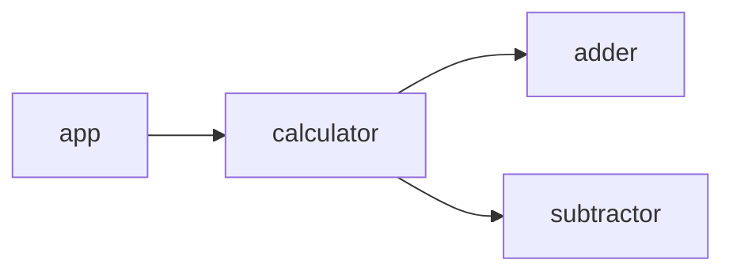
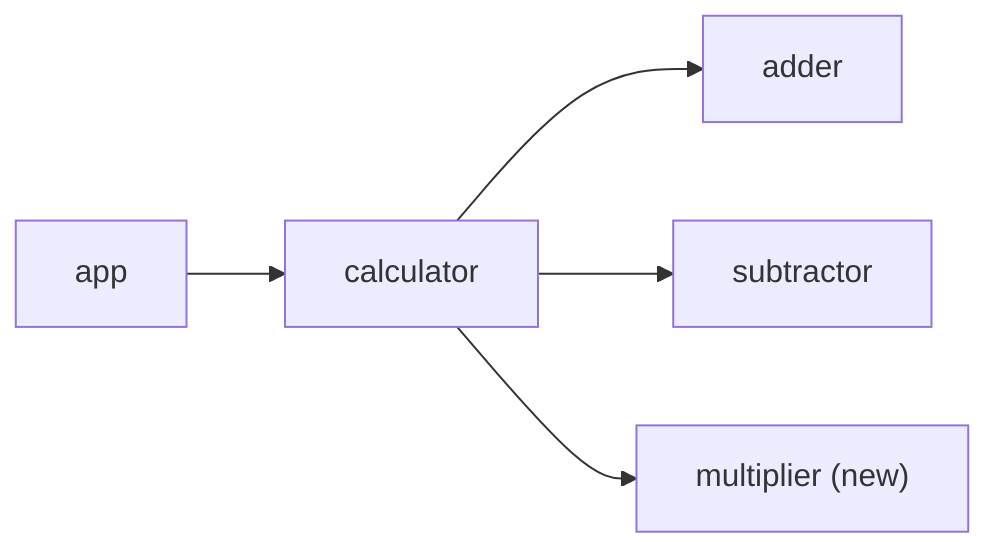

Sample Wasm Component Model
---

This repository contains a sample demonstrating the use of the [WebAssembly (Wasm) Component Model](https://component-model.bytecodealliance.org/introduction.html).

## Overview

This example implements a simple calculator using the [Wasm Component Model](https://component-model.bytecodealliance.org/introduction.html).
The calculator can perform basic operations such as addition, subtraction, and multiplication.

### Component Structure

Right after cloning, the component structure is as follows.
The `multiplier` component will be added later in a tutorial-like format in the **Adding New Components** section.



## Languages/Tools Used

| Language/Tool                                                             | Description                                                                                                                          |
|---------------------------------------------------------------------------|--------------------------------------------------------------------------------------------------------------------------------------|
| [Rust](https://www.rust-lang.org/)                                        | A systems programming language focusing on speed, memory safety, and parallelism. Used here for implementing WebAssembly components. |
| [cargo component](https://github.com/bytecodealliance/cargo-component)    | A command-line tool used for building WebAssembly components.                                                                        |
| [WebAssembly Compositions (WAC)](https://github.com/bytecodealliance/wac) | A tool used for composing WebAssembly components.                                                                                    |
| [Wasmtime](https://docs.wasmtime.dev/)                                    | A fast and secure runtime for executing WebAssembly modules, including support for the Wasm Component Model.                         |

## How to Use

### 1. Build Each Component

Run the following commands to build each component:

```shell
# Build the adder component
cd adder && cargo component build --release && cd ../
# Build the subtractor component
cd subtractor && cargo component build --release && cd ../
# Build the calculator component
cd calculator && cargo component build --release && cd ../
# Build the app component
cargo component build --release
```

### 2. Compose Components

Next, compose the components together using the `WAC` tool:

```shell
# Plug calculator with adder and subtractor components
wac plug calculator/target/wasm32-wasip1/release/calculator.wasm \
    --plug adder/target/wasm32-wasip1/release/adder.wasm \
    --plug subtractor/target/wasm32-wasip1/release/subtractor.wasm \
    -o composed.wasm

# Plug app with the composed module
wac plug target/wasm32-wasip1/release/app.wasm \
    --plug composed.wasm \
    -o main.wasm
```

### 3. Run the Application

Run the WebAssembly module using Wasmtime:

```shell
wasmtime run main.wasm 2 1 add
# => 2 + 1 = 3
wasmtime run main.wasm 2 1 sub
# => 2 - 1 = 1
```

## Adding New Components

To add a new component, follow these steps.
In this example, a `multiplier` component will be added for multiplication.

### Component Structure



### 1. Create the Multiplier Component

#### 1.1. Initialize the Project

Use the following command to create a new library component:

```shell
cargo component new --lib multiplier
```

**Note:** For a library component, specify `--lib`. For a command component, specify `--command` or leave it unspecified when initializing the project.

#### 1.2. Add a WIT (Wasm Interface Type) File

Create a WIT file to define the multiplier component:

**wit/multiplier/world.wit**
```wit
package component:multiplier@0.1.0;

interface multiply {
  multiply: func(x: u32, y: u32) -> u32;
}

world multiplier {
  export multiply;
}
```

For details on the WIT specifications, please refer to the official documentations ([WIT - The WebAssembly Component Model](https://component-model.bytecodealliance.org/design/wit.html), [The wit format - GitHub](https://github.com/WebAssembly/component-model/blob/main/design/mvp/WIT.md)).

#### 1.3. Modify `Cargo.toml`

Update the `Cargo.toml` with the component's information (such as the location of the WIT file and dependencies):

**multiplier/Cargo.toml**
```toml
# ...

[package.metadata.component]
package = "component:multiplier"

[package.metadata.component.dependencies]

[package.metadata.component.target]
path = "../wit/multiplier"
world = "multiplier"

[package.metadata.component.target.dependencies]
```

#### 1.4. Generate `bindings.rs`

Run the following command to generate the required bindings:

```shell
cd multiplier && cargo component build && cd ../
```

Ensure that `multiplier/src/bindings.rs` has been generated.

<details>
<summary>Troubleshooting</summary>
The following error may occur, but you can safely ignore it.

```shell
error[E0432]: unresolved import `bindings::Guest`
 --> src/lib.rs:4:5
  |
4 | use bindings::Guest;
  |     ^^^^^^^^^^^^^^^ no `Guest` in `bindings`
  |
help: consider importing this trait instead
  |
4 | use crate::bindings::exports::component::multiplier::multiply::Guest;
  |     ~~~~~~~~~~~~~~~~~~~~~~~~~~~~~~~~~~~~~~~~~~~~~~~~~~~~~~~~~~~~~~~~

For more information about this error, try `rustc --explain E0432`.
error: could not compile `multiplier` (lib) due to 1 previous error
```

**The subsequent steps assume that your current directory is the project root, so please move there if necessary.**
</details>

#### 1.5. Implement the Guest Trait

Finally, implement the `Guest` trait:

**multiplier/src/lib.rs**
```rust
#[allow(warnings)]
mod bindings;

use bindings::exports::component::multiplier::multiply::Guest;

struct Component;

impl Guest for Component {
    fn multiply(x: u32, y: u32) -> u32 {
        x * y
    }
}

bindings::export!(Component with_types_in bindings);
```

### 2. Add Multiplier to the Calculator Component

#### 2.1. Edit the WIT (Wasm Interface Type) File

Update the `calculator` component's WIT file to import the `multiplier`:

**wit/calculator/world.wit**
```wit
package component:calculator@0.1.0;

interface calculate {
  enum op {
    add,
    sub,
    mul,  // New operation
  }
  calculate: func(op: op, x: u32, y: u32) -> u32;
}

world calculator {
  import component:adder/add@0.1.0;
  import component:subtractor/subtract@0.1.0;
  import component:multiplier/multiply@0.1.0;  // New import
  export calculate;
}
```

#### 2.2. Update `Cargo.toml`

Update the dependencies:

**calculator/Cargo.toml**
```toml
# ...

[package.metadata.component.target.dependencies]
"component:adder" = { path = "../wit/adder" }
"component:subtractor" = { path = "../wit/subtractor" }
"component:multiplier" = { path = "../wit/multiplier" }  # New dependency
```

#### 2.3. Regenerate `bindings.rs`

Run the following command to regenerate the bindings:

```shell
cd calculator && cargo component build && cd ../
```

<details>
<summary>Troubleshooting</summary>
The following error may occur, but you can safely ignore it.

```shell
error[E0004]: non-exhaustive patterns: `Op::Mul` not covered
   --> src/lib.rs:11:15
    |
11  |         match op {
    |               ^^ pattern `Op::Mul` not covered
    |
note: `Op` defined here
   --> src/bindings.rs:99:26
    |
99  |                 pub enum Op {
    |                          ^^
...
102 |                     Mul,
    |                     --- not covered
    = note: the matched value is of type `Op`
help: ensure that all possible cases are being handled by adding a match arm with a wildcard pattern or an explicit pattern as shown
    |
13  ~             Op::Sub => subtract(x, y),
14  ~             Op::Mul => todo!(),
    |

For more information about this error, try `rustc --explain E0004`.
error: could not compile `calculator` (lib) due to 1 previous error
```

**The subsequent steps assume that your current directory is the project root, so please move there if necessary.**
</details>

#### 2.4. Update the Guest Trait

Modify the `Guest` trait:

**calculator/src/lib.rs**
```rust
// ...

impl Guest for Component {
    fn calculate(op: Op, x: u32, y: u32) -> u32 {
        match op {
            Op::Add => add(x, y),
            Op::Sub => subtract(x, y),
            Op::Mul => multiply(x, y),  // New operation
        }
    }
}

// ...
```

### 3. Add Multiplier to the App Component

#### 3.1. Update `Cargo.toml`

Update the dependencies:

**Cargo.toml**
```toml
# ...

[package.metadata.component.target.dependencies]
"component:calculator" = { path = "wit/calculator" }
"component:adder" = { path = "wit/adder" }
"component:subtractor" = { path = "wit/subtractor" }
"component:multiplier" = { path = "wit/multiplier" }  # New dependency
```

#### 3.2. Regenerate `bindings.rs`

Run the following command to regenerate the bindings:

```shell
cargo component build
```

<details>
<summary>Troubleshooting</summary>
The following error may occur, but you can safely ignore it.

```shell
error[E0004]: non-exhaustive patterns: `&Op::Mul` not covered
  --> src/main.rs:18:15
   |
18 |         match self {
   |               ^^^^ pattern `&Op::Mul` not covered
   |
note: `Op` defined here
  --> src/bindings.rs:13:22
   |
13 |             pub enum Op {
   |                      ^^
...
16 |                 Mul,
   |                 --- not covered
   = note: the matched value is of type `&Op`
help: ensure that all possible cases are being handled by adding a match arm with a wildcard pattern or an explicit pattern as shown
   |
20 ~             Op::Sub => write!(f, "-"),
21 ~             &Op::Mul => todo!(),
   |

For more information about this error, try `rustc --explain E0004`.
error: could not compile `app` (bin "app") due to 1 previous error
```
</details>

#### 3.3. Edit `main.rs`

Update `main.rs` to parse the new operation:

**src/main.rs**
```rust
// ...

fn parse_operator(op: &str) -> anyhow::Result<Op> {
    match op {
        "add" => Ok(Op::Add),
        "sub" => Ok(Op::Sub),
        "mul" => Ok(Op::Mul),  // New operation
        _ => anyhow::bail!("Unknown operation: {}", op),
    }
}

impl fmt::Display for Op {
    fn fmt(&self, f: &mut fmt::Formatter) -> fmt::Result {
        match self {
            Op::Add => write!(f, "+"),
            Op::Sub => write!(f, "-"),
            Op::Mul => write!(f, "*"),  // New operator display
        }
    }
}

// ...
```

### 4. Build & Run

#### 4.1. Build Each Component

```shell
# Build the multiplier component
cd multiplier && cargo component build --release && cd ../
# Build the calculator component
cd calculator && cargo component build --release && cd ../
# Build the app component
cargo component build --release
```

#### 4.2. Compose Components

```shell
# Plug calculator with adder, subtractor, and multiplier components
wac plug calculator/target/wasm32-wasip1/release/calculator.wasm \
    --plug adder/target/wasm32-wasip1/release/adder.wasm \
    --plug subtractor/target/wasm32-wasip1/release/subtractor.wasm \
    --plug multiplier/target/wasm32-wasip1/release/multiplier.wasm \
    -o composed.wasm

# Plug app with the composed module
wac plug target/wasm32-wasip1/release/app.wasm \
    --plug composed.wasm \
    -o main.wasm
```

#### 4.3. Run the Application

```shell
wasmtime run main.wasm 2 1 add
# => 2 + 1 = 3
wasmtime run main.wasm 2 1 sub
# => 2 - 1 = 1
wasmtime run main.wasm 2 1 mul
# => 2 * 1 = 2
```
